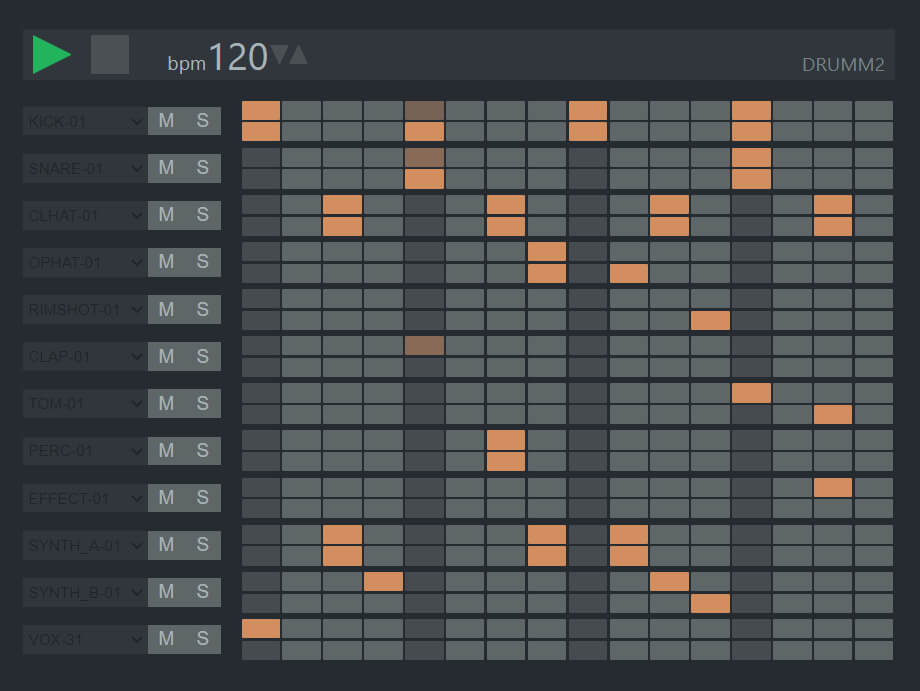

# **Drumm2**
### **Drumm2** is an online step sequencer for quickly creating electronic music from samples
 

 

___

### Application features:
* Choose samples
* Change BPM
* Play solo track
* Mute track
___
### **[Demo page](https://rmstcv.github.io/drumm2/build)**

#### **[Description of components](docs.md)**
