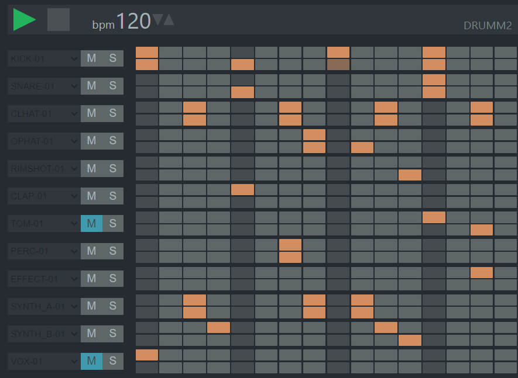

# **Drumm2**

### **Drumm2** is an online step sequencer for quickly creating electronic music from samples

 

 

---

### Application features:

- Choose samples
- Change BPM
- Play solo track
- Mute track

---

### **[Demo page](https://rmstcv.github.io/drumm2/)**

#### **[docs](doc/Description%20of%20components.md)**
